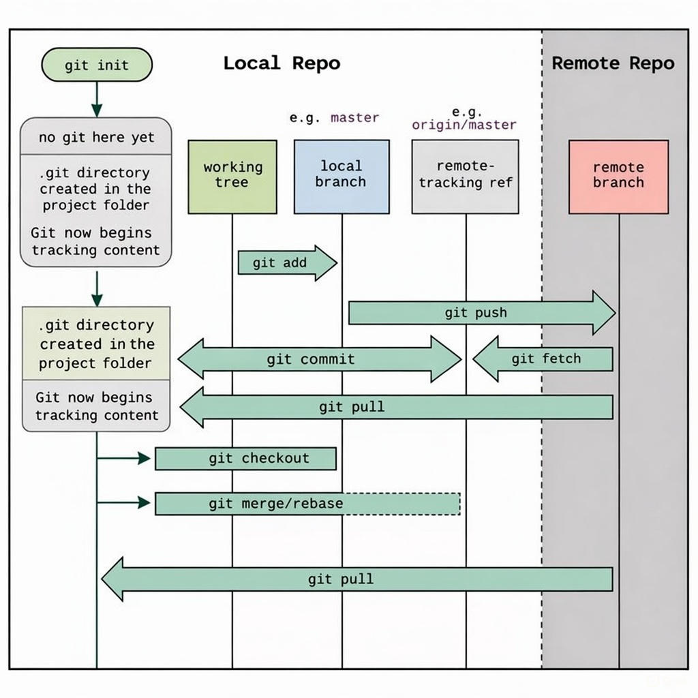

## Why Git Exists
Git was created to solve five fundamental problems developers face.
- Time Travel - Go back to any point in your project's history
- Experiment Safely - Try new ideas without breaking your working version
- Collaborate Smoothly - Multiple people working simultaneously without conflicts
- Accountability - Who changed what, when, and why?
- Recovery - Undo mistakes or restore deleted work

### Version Control Philosophy
In modern software development, tracking changes, managing multiple versions of code, and collaborating efficiently are essential. These challenges are solved using Version Control Systems (VCS).
Git is the most widely used version control system in the world, helping developers work confidently on both personal projects and large team-based codebases.

Git allows developers to:
- Track every change made to a project
- Maintain multiple versions without copying files manually
- Collaborate smoothly with individuals or teams

### What Is Version Control?
Before understanding Git, it’s important to understand version control itself.

Version control is a system that tracks changes to files over time. It allows developers to manage the history of a project safely and efficiently.

With version control, developers can:

- Save and Track Changes: Every modification to the codebase is recorded, along with who made the change and why.\
- Revert to Previous Versions: If a bug is introduced or something breaks, developers can restore the project to an earlier, stable version.
- Collaborate Safely: Multiple developers can work on the same project at the same time without overwriting each other’s work.
- Branch and Merge: Developers can create branches for new features or fixes, work independently, and merge their changes back into the main code when ready.

### Introduction to Git
Git is a distributed version control system created by Linus Torvalds in 2005.

Unlike centralized systems, Git allows each developer to work on a local copy of the entire project, including its full history. Developers can then share their work by pushing changes to a shared remote repository.

Git provides several powerful features that make it ideal for modern development:

🔹 Version Tracking: All changes are tracked in a structured history, allowing easy rollbacks to previous versions.

🔹 Collaboration: Multiple developers can work on the same project simultaneously without conflicts.

🔹 Branching: Developers can create separate branches for features, bug fixes, or experiments without affecting the main codebase.

🔹 Distributed System: Each developer has a full copy of the repository, removing dependency on a single central server.

🔹 Commit History (Logs): Git maintains a detailed record of commits, making it easy to understand how and why a project has evolved.

### Git vs GitHub
- Git is a version control system that runs on your local machine. It tracks code changes, keeps history, and lets you undo mistakes. It works even without internet.

- GitHub is a cloud platform that hosts Git repositories. It lets developers share code, review changes, and collaborate using pull requests and issues.

## Git Workflow States


<p align="center">
  
</p>

### git init (Start of Everything)

**What it does**
- Initializes a new Git repository in your project folder.
- Creates a hidden .git/ directory.

**What changes**
- Before git init: Folder is just normal files (Git doesn’t know anything)
- After git init: Git starts tracking changes

**Key idea**
- git init turns a normal folder into a Git repository.

### .git Directory (Behind the Scenes)
**What it contains**

- Complete project history
- Commits, branches, tags
- Configuration and metadata

**Important**
- You never manually edit .git
- Git reads and writes here automatically

**Key idea**
- .git is the brain of Git.

### Working Tree (Working Directory)
**What it is**
- Your actual project files
- Where you write code, edit files, delete things

**State**
- Files can be:
- Modified
- New (untracked)
- Deleted

**Key idea**
- Working tree = your current workspace.
### Staging Area (Index)
**What it is**
- A preparation area before committing
- You choose what goes into the next commit

**Why it exists**
- You might change many files
- But only want to commit some of them

**Key idea**
- Staging is a “review table” before saving history.

### git add

**What it does**
- Takes a snapshot of selected file changes
- Moves them into the staging area

**Important**
- It does NOT create a commit
- It prepares content for commit

**Key idea**
- git add selects what will be recorded.

### Local Repository (Local Branch)
**What it is**
- Stored inside .git
- Contains committed snapshots (history

**Key idea**
- Local repo = permanent project history on your machine.


### git commit

**What it does**
- Saves a snapshot of staged files
- Creates a commit object with:
- Unique hash
- Author
- Date
- Commit message

**Best practice**
- One logical change per commit
- Clear message (what & why)

**Key idea**
- Commit = save point in project history.

### Commit History (git log)

**What it shows**
- Timeline of project changes
- Ordered list of commits

**Key idea**
- Git history tells the story of your project.

### Remote Repository
**What it is**
- Central shared repository
- Usually hosted on GitHub, GitLab, Bitbucket

**Purpose**
- Collaboration
- Backup
- Code sharing

**Key idea**
- Remote repo is for sharing, not required for Git to work.


### Remote Branch (origin/main)
**What it represents**
- Actual branch on the remote server

**Key idea**
- Remote branch lives on the server

### Remote-Tracking Branch

**What it is**
- Local reference of remote branch
- Read-only pointer

**Key idea**
- Remote-tracking branch shows “what the remote looks like”.

### git push
**What it does**
- Sends local commits to remote repository

**Key idea**
- Push = publish your work.

### git fetch
**What it does**
- Downloads changes from remote
- Does NOT modify your working files

**Key idea**
- Fetch = check what others have done.

### git pull

**What it does**
- git fetch + git merge
- Updates your local branch and working tree

**Key idea**
- Pull = update your local work.


### git checkout
**What it does**
- Switch branches
- Restore files

**Key idea**
- Checkout = move between versions.

### git merge / git rebase
**Purpose**
- Combine changes from different branches

**Merge**
- Keeps history
- Creates a merge commit

**Rebase**
- Rewrites history
- Cleaner linear timeline

**Key idea**
- Merge joins histories, rebase rewrites them.

---
## Daily Git Commands
- Working directory
- Staging
- Repository
- The Art of the Commit Message
- Git Config 
   
Initialize a new Git repository. it will be Creates a hidden .git/ directory
```bash
git init
```
Check the state of files (modified, staged, untracked). Shows what’s changed and what’s ready to commit.
```bash
git status
```

Set username & email, Sets your Git username for all repositories on your system.Personal laptop, same name/email used for most projects
```bash
git config --global user.name "Nasir Uddin"
git config --global user.email "nasir@example.com"
```
Sets username only for the current repository, Multiple Git identities (work vs personal)
```bash
git config user.name "Nasir Uddin"
git config user.email "nasir@example.com"
```

View all global config.
```bash
git config --global --list
```
Displays effective configuration for the current repository.
```bash
git config --list
```
Remove a specific global config (recommended)
```bash
git config --global --unset user.name
git config --global --unset user.email
```
Moves changes from working directory to staging area, **.** add everything and Select changes for next commit.
```bash
git add app.py
git add .
```
Saves staged changes into the repository history and Permanently save staged changes.
```bash
git commit -m "Add user login validation"
```
Shows full commit history,Shows commit ID, Author name & email, Date and Commit message.
```bash
git log

```
Compact, visual commit history,One line per commit and Graph shows branches and merges
```bash
git log --oneline --graph
```
Shows details of a specific commit
```bash
git show a1b2c3d
```
Shows commit history with code changes,-p means patch, shows code diffs for each commit,useful for deep review
```bash
git log -p
```

Summary of file changes per commit, Shows which files changed shows number of lines added/removed
```bash
git log --stat
```
Files Git should NOT track
```bash
vim .gitignore

node_modules/
.env
*.log
dist/
```
---
## Undo Without Fear
- Local mistake vs shared mistake


You jump into that commit’s code immediately, Code looks exactly like that commit.
```bash
git log --oneline --graph
git checkout d3bf479
git brach
git checkout main
```

Used to discard changes in the working directory or staging area. File is restored from the last commit.
```bash
git restore README.md
```

Used to modify the last commit,Opens editor and Lets you change commit message. If already pushed, use *--force*
```bash
git commit --amend
git push --force
```

Risky, Moves HEAD and optionally clears staging & working directory. Removes last commit and Changes stay staged.
```bash
git reset
```
Soft reset (keep changes staged), Removes last commit and Changes stay staged.
```bash
git reset --soft HEAD~1
```

Hard reset (DANGEROUS) removes last commit. Deletes all local changes and use only if you are 100% sure.
```bash
git reset --hard HEAD~1
```

## Branching (Real Life Use)
- Why branches exist
- Feature branch idea
- main vs feature branch
- The Special HEAD Pointer
- Rebase

```bash
git branch
git checkout -b
git merge
git merge --ff-only
git switch
git rebase main
git pull --rebase
git rebase -i

```

## GitHub / GitLab Workflow
- Local vs remote
- origin
- clone vs fork
- Pull Request Workflow

```bash
git clone
git remote -v
git push
git push -u origin
git pull
git fetch
git remote add
git branch -vv
```

## Stash + Real Scenarios
- The Stash Stack
- When to Stash vs. Commit
- Cleaning the Working Directory
- Used for hotfixes & selective commits

```bash
git stash
git stash pop
git stash list
git stash -u
git clean -fd
git cherry-pick <commit-id>
```

## How Teams Use Git (DevOps Angle)
- Feature branch workflow
- Gitflow (only concept)
- Trunk-based (CI/CD teams)
- Git as source of truth
- Git + Jenkins / GitHub Actions
- Intro to GitOps (high level)
- Tags & Releases (DevOps / CI/CD Must)
- Advanced Debugging & Recovery

```bash
git tag
git tag -a v1.0 -m "Release v1.0"
git push origin --tags
git describe
git log --grep="bug"
git log -S "password"
git shortlog
git blame file.txt
git reflog
```